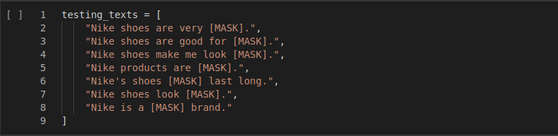
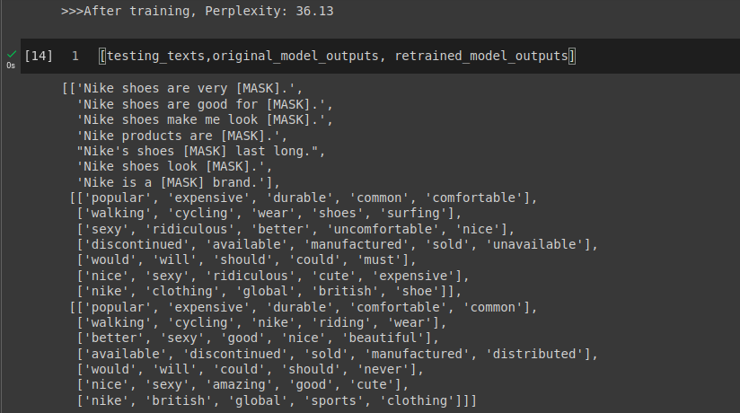
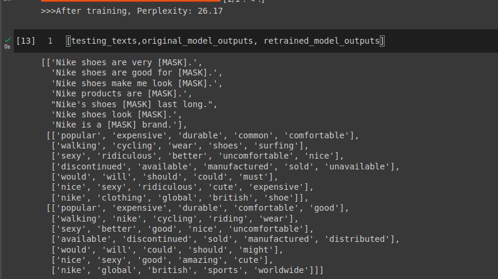

## Tasks:

1. These are the testing texts i defined for the model

2.  In addition to the data provided in uptrain example i scraped some reviews from some products in amazon using [this](https://github.com/sanjaybora04/Nike_Masked_LM/blob/main/web_scrapping.py) script

3. I filtered reviews from amazon by scraping only 5 star reviews, However an uptrain signal could also be trained using rating of reviews to filter the data.
---
## Results:

### Before:-

### After:-

* As you can see the perplexity has improved and predictions are also better
* Theres still room for improvement, more effort could be put into making the dataset to improve the results further.
